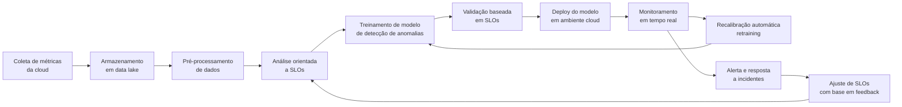
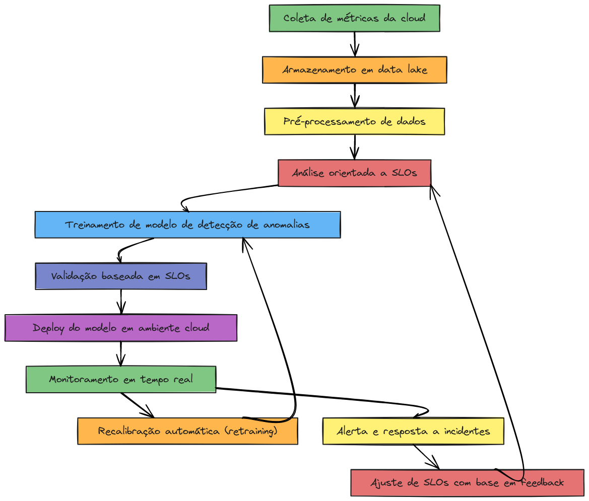

# 🧠 MLOps Pipeline - Análise de Anomalias orientado a SLOs

Este projeto implementa um pipeline completo de MLOps para **detecção de anomalias em ambientes de nuvem**, orientado por **SLOs (Service Level Objectives)**. O objetivo é garantir a confiabilidade de sistemas distribuídos com monitoramento contínuo, alertas automáticos, e retraining de modelos com base em violações de SLOs.

---

## 📌 Componentes do Pipeline

- 🔍 Coleta de métricas da cloud (ex: Prometheus)
- 📦 Armazenamento de dados em data lake
- 🧼 Pré-processamento com limpeza e normalização
- 🎯 Análise e validação com base em SLOs (PostgreSQL)
- 🧠 Treinamento com Isolation Forest (modelo de anomalia)
- 🚀 Deploy com MLflow Tracking e Serving
- 📈 Monitoramento em tempo real
- 🔁 Recalibração automática com novo treinamento
- 🚨 Alertas via Alertmanager
- 👤 Interface para ajuste de SLOs com Streamlit

---

## 🛠️ Setup do Projeto

```bash
# Clone o repositório
git clone https://github.com/mbenedicto99/SLO-Pipeline
cd SLO-Pipeline

# Crie e ative o ambiente virtual
python3 -m venv venv
source venv/bin/activate

# Instale as dependências
pip install -r requirements.txt

# Inicie o MLflow Tracking UI (em outra aba)
mlflow ui
```

---

## 🗺️ Diagrama Mermaid



---

## 🖼️ Diagrama Ilustrado

> Representação visual do pipeline completo:



---

## 🧪 Ferramentas utilizadas

- **Python**
- **scikit-learn**
- **MLflow**
- **Prometheus / Alertmanager**
- **PostgreSQL**
- **Streamlit**

---

## ✅ Teste rápido do ambiente

Para verificar se o ambiente está corretamente configurado, execute este script de teste:

```python
# test_env.py

import mlflow
import pandas as pd
from sklearn.ensemble import IsolationForest
from sklearn.datasets import make_blobs

print("✅ Bibliotecas importadas com sucesso!")

# Gerar dados de exemplo
X, _ = make_blobs(n_samples=100, centers=1, cluster_std=0.5, random_state=42)

# Treinar modelo de exemplo
model = IsolationForest(n_estimators=50)
model.fit(X)

print("✅ Modelo treinado com sucesso!")

# Log no MLflow local
mlflow.set_experiment("Teste_MLOps")
with mlflow.start_run():
    mlflow.log_param("n_estimators", 50)
    mlflow.sklearn.log_model(model, "model")
    print("✅ Modelo logado no MLflow!")
```

Execute com:

```bash
python test_env.py
```

UI do MLflow (http://localhost:5000).

---

## 🚀 Execução dos Experimentos com MLflow

Este projeto é compatível com **MLflow Projects**. Você pode executar os experimentos diretamente da linha de comando.

### ✅ Usando ambiente virtual (sem Conda)

Certifique-se de ativar seu ambiente `venv` e execute com `--no-conda`:

```bash
mlflow run . --no-conda -e isolation
mlflow run . --no-conda -e gradient_descent
```

### ✅ Usando Conda (se disponível)

```bash
mlflow run . -e isolation
mlflow run . -e gradient_descent
```

### ✅ Executar experimento padrão (`main`)

Se o `MLproject` incluir um entry point `main`, use:

```bash
mlflow run . --no-conda
```

---

## 🧪 Entry Points disponíveis

| Entry Point       | Descrição                                              |
|-------------------|--------------------------------------------------------|
| `isolation`       | Detecção de anomalias com Isolation Forest (complexo) |
| `gradient_descent`| Visualização de descida com Gradiente Descendente 3D  |

---

## 🧹 Solução de Problemas

### ❌ `Could not find Conda executable`
> Execute com `--no-conda` se estiver usando ambiente `venv`.

### ❌ `Could not find main among entry points`
> Use `-e <entry_point>` com o nome correto ou defina um `main` no MLproject.

### ❌ `Could not find experiment with ID 0`
> Execute `mlflow.set_experiment("nome")` no script e remova o diretório `mlruns/`.

```bash
rm -rf mlruns/
```

---

## 📦 Organização dos scripts

| Script                              | Função                                     |
|-------------------------------------|--------------------------------------------|
| `test_isolation_forest.py`          | Anomalias simples                          |
| `test_isolation_forest_complex.py`  | Anomalias com dados mistos e PCA           |
| `test_env_rf.py`                    | Classificação com RandomForest             |
| `gradient_descent_3d.py`            | Descida de montanha em 3D com visualização |

## 📜 Licença

Este projeto está licenciado sob a [MIT License](LICENSE).
