# 🧠 MLOps Pipeline - Análise de Anomalias orientado a SLOs

Este projeto implementa um pipeline completo de MLOps para **detecção de anomalias em ambientes de nuvem**, orientado por **SLOs (Service Level Objectives)**. O objetivo é garantir a confiabilidade de sistemas distribuídos com monitoramento contínuo, alertas automáticos, e retraining de modelos com base em violações de SLOs.

---

## 📌 Componentes do Pipeline

- 🔍 Coleta de métricas da cloud (ex: Prometheus)
- 📦 Armazenamento de dados em data lake
- 🧼 Pré-processamento com limpeza e normalização
- 🎯 Análise e validação com base em SLOs (PostgreSQL)
- 🧠 Treinamento com Isolation Forest (modelo de anomalia)
- 🚀 Deploy com MLflow Tracking e Serving
- 📈 Monitoramento em tempo real
- 🔁 Recalibração automática com novo treinamento
- 🚨 Alertas via Alertmanager
- 👤 Interface para ajuste de SLOs com Streamlit

---

## 🛠️ Setup do Projeto

```bash
# Clone o repositório
git clone https://github.com/mbenedicto99/SLO-Pipeline
cd SLO-Pipeline

# Crie e ative o ambiente virtual
python3 -m venv venv
source venv/bin/activate

# Instale as dependências
pip install -r requirements.txt

# Inicie o MLflow Tracking UI (em outra aba)
mlflow ui
```

---

## 🗺️ Diagrama Mermaid

```mermaid
graph LR
  A["Coleta de métricas<br/>da cloud"]
  B["Armazenamento<br/>em data lake"]
  C["Pré-processamento<br/>de dados"]
  D["Análise orientada<br/>a SLOs"]
  E["Treinamento de modelo<br/>de detecção de anomalias"]
  F["Validação baseada<br/>em SLOs"]
  G["Deploy do modelo<br/>em ambiente cloud"]
  H["Monitoramento<br/>em tempo real"]
  I["Recalibração automática<br/>retraining"]
  J["Alerta e resposta<br/>a incidentes"]
  K["Ajuste de SLOs<br/>com base em feedback"]

  A --> B --> C --> D --> E --> F --> G --> H
  H --> I --> E
  H --> J --> K --> D
```



---

## 🖼️ Diagrama Ilustrado

> Representação visual do pipeline completo:


---

## 🧪 Ferramentas utilizadas

- **Python**
- **scikit-learn**
- **MLflow**
- **Prometheus / Alertmanager**
- **PostgreSQL**
- **Streamlit**

---

## 📜 Licença

Este projeto está licenciado sob a [MIT License](LICENSE).
---

## ✅ Teste rápido do ambiente

Para verificar se o ambiente está corretamente configurado, execute este script de teste:

```python
# test_env.py

import mlflow
import pandas as pd
from sklearn.ensemble import IsolationForest
from sklearn.datasets import make_blobs

print("✅ Bibliotecas importadas com sucesso!")

# Gerar dados de exemplo
X, _ = make_blobs(n_samples=100, centers=1, cluster_std=0.5, random_state=42)

# Treinar modelo de exemplo
model = IsolationForest(n_estimators=50)
model.fit(X)

print("✅ Modelo treinado com sucesso!")

# Log no MLflow local
mlflow.set_experiment("Teste_MLOps")
with mlflow.start_run():
    mlflow.log_param("n_estimators", 50)
    mlflow.sklearn.log_model(model, "model")
    print("✅ Modelo logado no MLflow!")
```

Execute com:

```bash
python test_env.py
```

Você verá as confirmações no terminal e o run logado na interface do MLflow (http://localhost:5000).
